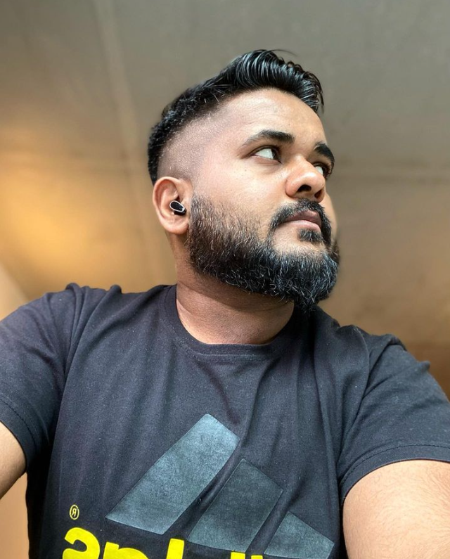

### **About me**
I am currently employed as a postdoctoral researcher at ETS Montreal and Hydro-Quebec. My research activities focus on the integration of blockchain technology within energy systems.

I received my Ph.D. from the Département de génie logiciel et des TI of the University ETS Montreal, Quebec in August 2022,with [Prof. Kaiwen Zhang](https://www.etsmtl.ca/en/research/professors/kzhang) as my advisor, and [Prof. Hans-Arno Jacobsen](https://www.ece.utoronto.ca/people/jacobsen-h-a/) as my co-advisor. I received Masters in Electrical Engineering from National University of Sciences & Technology, Pakistan. Before coming to ETS Montreal, I worked with [Prof. Marios Lestas](https://www.linkedin.com/in/marios-lestas-708aa5231/) as a research assistant under Erasmus + mobility project at the Frederick university, Cyprus. My hometown is Rawalpindi, Pakistan.

My Ph.D. research was focused on the trusted service selection of consumer applications including IoT and electric vehicles, using blockchain technology. I am excited about applying blockchain technology to secure and improve the implementations of consumer side applications people use day to day. 

Aside from work, I enjoy gym, video games, writing blogs, and listening to traditional indian music.

### **Contact me**

_Email:  syed-muhammad.danish.1 at etsmtl dot net_

### **Selected Publications**

Syed Muhammad Danish, Kaiwen Zhang, Hans-Arno Jacobsen. [BlockAIM: A Neural Network-Based Intelligent Middleware For Large-Scale IoT Data Placement Decisions](https://ieeexplore.ieee.org/document/9398554).
_IEEE Transactions on Mobile Computing 2021_

Syed Muhammad Danish, Kaiwen Zhang, Hans-Arno Jacobsen, Nouman Ashraf, Hassaan Khaliq Qureshi. [BlockEV:  Efficient and Secure Charging Station Selection for Electric Vehicles](https://ieeexplore.ieee.org/document/9310692).
_IEEE Transactions on Intelligent Transportation Systems 2020_

Muhammad Muneem Shabir, Syed Muhammad Danish, Kaiwen Zhang. [BlockQoS: Fair Monetization of On-Demand Quality-of-Service using Blockchains](https://dl.acm.org/doi/10.1145/3580284).
_ACM Distributed Ledger Technologies: Research and Practice 2023_

Syed Muhammad Danish, Kaiwen Zhang, Hans-Arno Jacobsen. [BlockAM: An Adaptive Middleware for Intelligent Data Storage Selection for Internet of Things](https://ieeexplore.ieee.org/abstract/document/9126003/).
_IEEE International Conference on Decentralized Applications and Infrastructures (DAPPS) 2020_
**Best Paper Award**

### **Research Projects**

TBW

### **Public Profiles**

- [Google Scholar](https://scholar.google.com.pk/citations?user=OAiYfI8AAAAJ&hl=en)
- [Research Gate](https://www.researchgate.net/profile/Syed_Danish4)
- [Dblp](https://dblp.uni-trier.de/pers/hd/d/Danish:Syed_Muhammad)
- [Medium](https://medium.com/@syedmuhammaddanish)
- [Linkedin](https://www.linkedin.com/in/syeddanish1992/)

### **Find my [CV](https://github.com/syedmuhamaddanish/syedmuhamaddanish.github.io/blob/main/CV.pdf)** 
